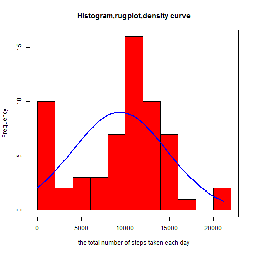
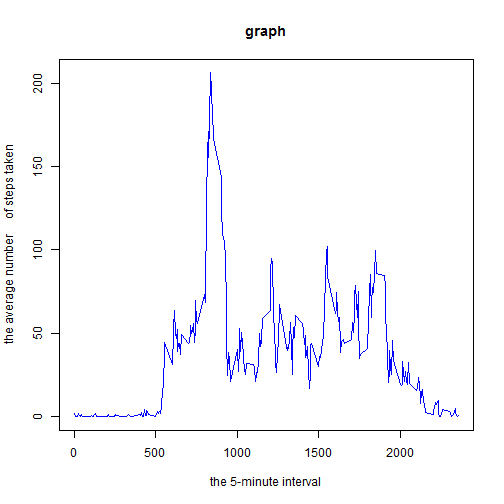
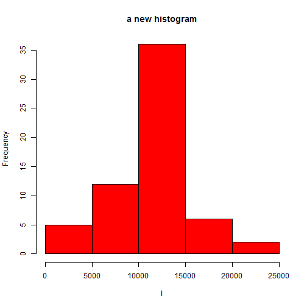
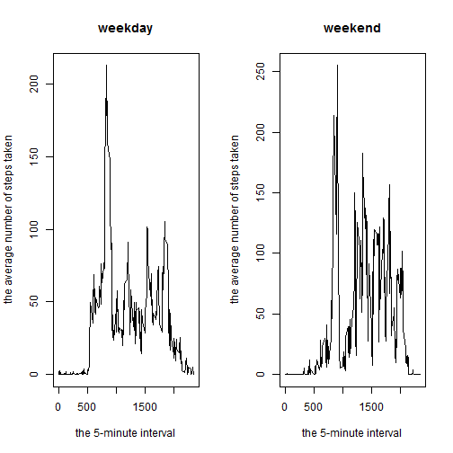

Assignment1
=============

##Loading and preprocessing the data


```r
##change the directory
setwd("C:\\Users\\asus\\Desktop\\R data")
 data<-read.csv("activity.csv")
data$date<-as.Date(data$date)
```

##What is mean total number of steps taken per day?


```r
d<-tapply(data$steps,data$date,sum,na.rm=T)

#make a histogram with density curve and rug.
hist(d,freq=F,breaks=10,col="red",xlab="the total number of steps taken each day",main="Histogram,rugplot,density curve")
rug(jitter(d))
lines(density(d),col="blue",lwd=2)
```

 

```r
#learn something from a book ,now i want to have   a try. now make a another histogram with normal curve and box.
h<-hist(d,breaks=10,col="red",xlab="the total number of steps taken each day",main="Histogram,rugplot,density curve")
xfit<-seq(min(d),max(d),length=40)
yfit<-dnorm(xfit,mean(d),sd=sd(d))
yfit<-yfit*diff(h$mids[1:2])*length(d)
lines(xfit,yfit,col="blue",lwd=2)
box()
```

 

```r
#then the mean and median total number of steps taken per day
paste("the mean is",round(mean(d),2))
```

```
## [1] "the mean is 9354.23"
```

```r
paste("the median is",median(d))
```

```
## [1] "the median is 10395"
```

##What is the average daily activity pattern?

###Make a time series plot ( type = "l") of the 5-minute interval (x-axis) and the average number of steps taken, averaged across all days (y-axis)


```r
  ms<-tapply(data$steps,data$interval,mean,na.rm=T)
  plot(names(ms),ms,xlab="the 5-minute interval",ylab="the average number     of steps taken",type="l",col="blue",main="graph") 
```

 

###Which 5-minute interval, on average across all the days in the dataset, contains the maximum number of steps?


```r
paste("the maximum number of steps is",round(max(ms),2))
```

```
## [1] "the maximum number of steps is 206.17"
```

```r
paste("the 5-minute interval contains the maximum number of steps is",names(ms[ms==max(ms)]))
```

```
## [1] "the 5-minute interval contains the maximum number of steps is 835"
```

##Imputing missing values

###Calculate and report the total number of missing values in the dataset

```r
paste("the total number of missing is",sum(is.na(data)))
```

```
## [1] "the total number of missing is 2304"
```

###filling in all of the missing values in the dataset.use the the mean for that 5-minute interval

```r
rawdata<-data
for(i in 1:length(ms)){
  data$steps[is.na(data$steps)&data$interval==names(ms[i])]<-ms[i]
}
```

###Make a histogram of the total number of steps taken each day and Calculate and report the mean and median total number of steps taken per day.


```r
l<-tapply(data$steps,data$date,sum)
hist(l,col="red",main="a new histogram")
```

 

```r
paste("the mean total number of steps is", round(mean(l),2))
```

```
## [1] "the mean total number of steps is 10766.19"
```

```r
paste("the median total number of steps is" ,round(median(l),2))
```

```
## [1] "the median total number of steps is 10766.19"
```

as we can see from the result,these values are differ from the estimates from the first part of the assignment.

##Are there differences in activity patterns between weekdays and weekends?


```r
data$week<-abs(weekdays(data$date)%in% c("星期六","星期天"))
data$week<-factor(data$week,levels=c(0,1),labels=c("weekday","weekend"))
```

###make plot

```r
##the weekday
par(mfrow=c(1,2))
h1<-tapply(data[data$week=="weekday",]$steps,data[data$week=="weekday",]$interval,mean)
plot(names(h1),h1,type="l",main="weekday",xlab="the 5-minute interval",ylab="the average number of steps taken")

##the weekend
h2<-tapply(data[data$week=="weekend",]$steps,data[data$week=="weekend",]$interval,mean)
plot(names(h2),h2,type="l",main="weekend",xlab="the 5-minute interval",ylab="the average number of steps taken")
```

 
